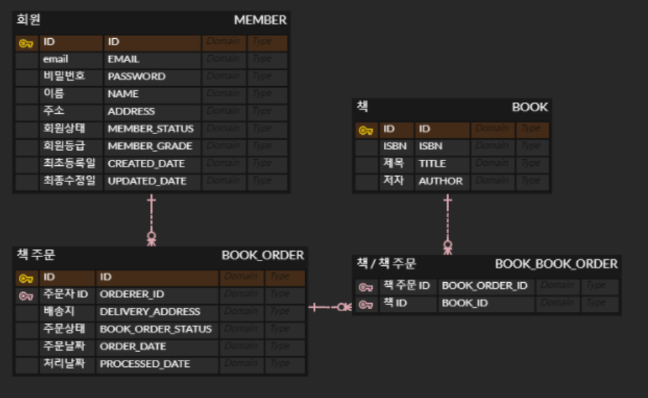

# bookside
도서 주문 사이트 (제작 중)

사용 기술
- Language
    - Java 1.8, Javascript (+ ES6)
- Framework
    - Spring Boot 2.1.2
    - Hibernate (Spring data JPA)
    - Bootstrap (CSS)
- ETC
    - Thymeleaf
    - Ehcache (예정)
    - Spring Mail (예정)
    - Spring Security (예정)

## 현재 구현 중

---

DB 설계

---

기능 목록 (예정)
- 회원
    - 로그인 (using Securiy)
    - 가입 요청
   
- 책 검색
    - 책 검색 (using Kakao book search API, Caching)
    - 책 정보 가져오기 (using Kakao book search API)
        - 책 주문에 담기
 
- 책 주문
    - 내 책 주문 목록
    - 책 주문하기
        - 주문 시 관리자 이메일로 해당 주문 내역 전송
 
- 내 정보
    - 정보 변경
 
- 관리자
    - 회원 관리 (+ 회원 가입 승인)
    - 책 주문 관리
        - 회원 별 요청 현황